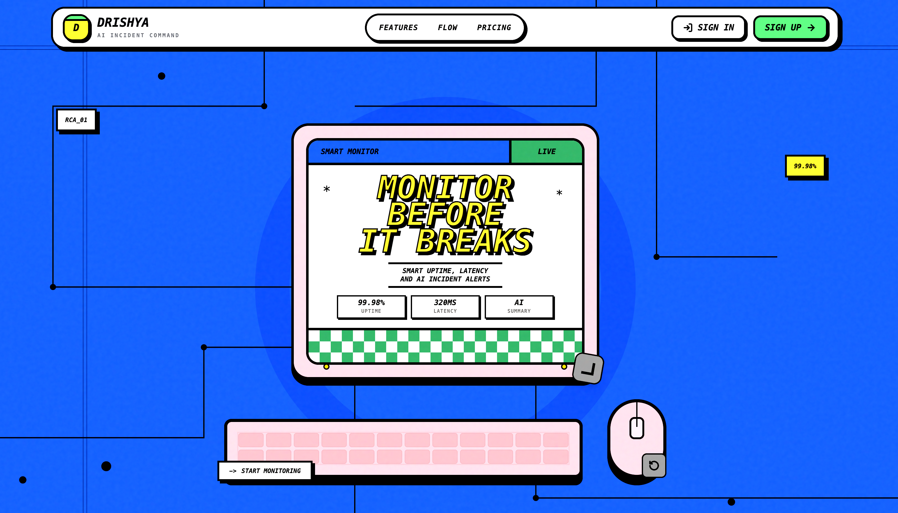
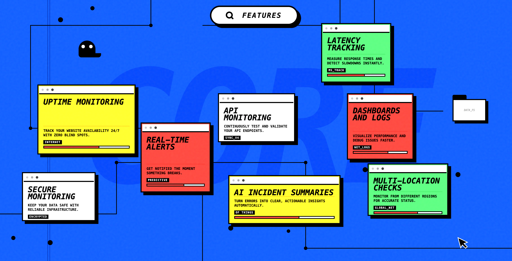
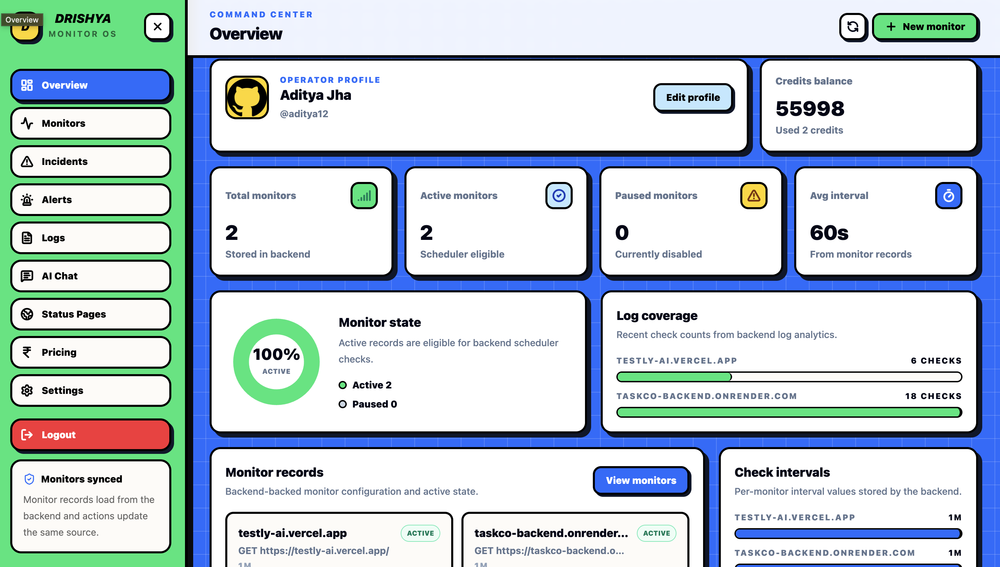
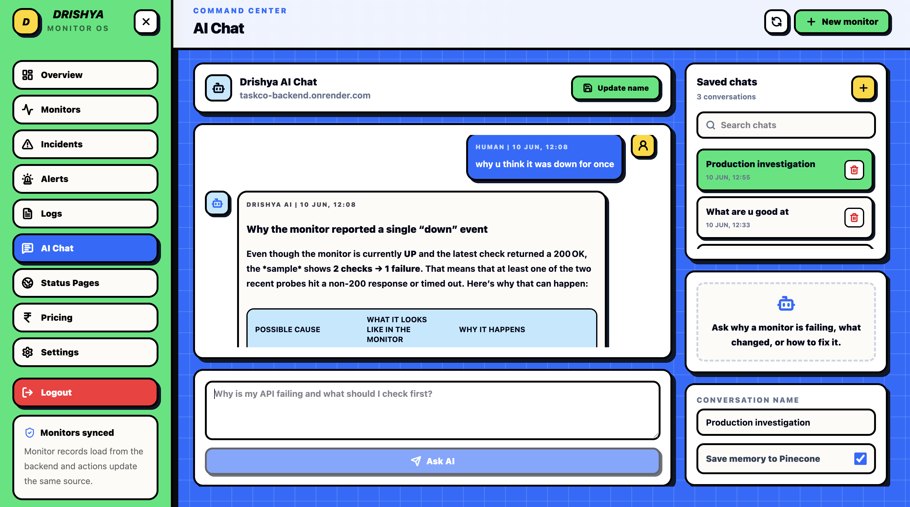

# Drishya - Smart Monitoring Web Platform

Drishya is a production-ready monitoring platform for websites and APIs. It combines uptime checks, raw logs, incidents, alerts, public status pages, AI investigation chat, reports, profile management, credits, and INR payments.

The app is split into a Vite React frontend and an Express/Mongo backend. The intended production deployment is frontend on Vercel and backend on Render.

## Demo






## What It Does

- Email/password auth with OTP verification, Google OAuth, and GitHub OAuth
- Optional username, profile editing, profile image upload through ImageKit, and default user credits
- Monitor CRUD for websites and APIs with method, interval, timeout, headers, request body, expected status, response keyword, SSL, DNS, regions, cron, groups, projects, and public status toggles
- SSRF protection for monitor URLs, including rejection of private/internal hosts
- BullMQ + Redis background checks, immediate first check after monitor creation, and Redis locks to avoid duplicate scheduler jobs across instances
- Raw check logs with latency, status, error, check type, region, checked time, and CSV export
- Incident creation, AI incident summaries, incident timeline, CSV/PDF export, and email report delivery
- Resend email alerts through RabbitMQ and alert worker
- Public monitor and project status pages
- AI chat with saved conversations, Pinecone memory, monitor context, searchable saved chats, editable names, and delete support
- Credit balance, hourly active-monitor billing, Razorpay order creation, backend signature verification, and INR credit packs

## Architecture

```text
User browser
  -> Vercel frontend (React/Vite)
  -> Render backend (Express API + workers)
  -> MongoDB (users, monitors, logs, incidents, alerts, chat, billing)
  -> Redis/BullMQ (monitor queue, alert queue, locks, counters)
  -> RabbitMQ (notification events)
  -> Resend (email)
  -> Groq (AI answers/incident insight)
  -> Pinecone (optional chat memory)
  -> Razorpay (credit payments)
  -> ImageKit (profile images)
```

## Repository Structure

```text
.
|-- backend/                  # Express API, workers, queues, monitoring logic
|   |-- server.js             # Bootstraps DB, queues, workers, Socket.IO, graceful shutdown
|   |-- src/app.js            # Express app, CORS, routes, error handling
|   |-- src/config/           # Redis, env validation, BullMQ options
|   |-- src/modules/          # Feature modules
|   |-- src/queues/           # Queue definitions
|   |-- src/sockets/          # Socket.IO helpers
|   `-- src/workers/          # BullMQ workers
|-- frontend/                 # React + Vite client
|   |-- public/               # Static assets, demo screenshots, robots, manifest
|   |-- src/components/       # Shared components
|   |-- src/pages/            # Home, auth, dashboard, admin
|   |-- src/services/         # Axios/API/socket clients
|   `-- src/store/            # Redux slices/selectors
|-- .gitignore
|-- LICENSE
`-- README.md
```

## Requirements

- Node.js 18+
- npm
- MongoDB
- Redis with BullMQ support
- RabbitMQ
- Resend account
- Groq API key
- Razorpay key ID and secret
- ImageKit keys
- Optional Pinecone index for chat memory

## Clone And Install

```bash
git clone <your-repo-url>
cd Smart-Monitoring-Web-Platform

cd backend
npm install

cd ../frontend
npm install
```

## Backend Setup

Create `backend/.env` from the example:

```bash
cd backend
cp .env.example .env
```

Important backend variables:

```env
NODE_ENV=development
PORT=3000
BACKEND_URL=http://localhost:3000
FRONTEND_URL=http://localhost:5173
CORS_ORIGIN=http://localhost:5173

MONGO_URI=mongodb://localhost:27017/drishya-auth

REDIS_URL=
REDIS_HOST=127.0.0.1
REDIS_PORT=6379
BULLMQ_SKIP_VERSION_CHECK=true

RABBITMQ_URL=amqp://localhost:5672
RESEND_API_KEY=
EMAIL_FROM=Drishya <no-reply@example.com>
ALERT_FAILURE_THRESHOLD=1
ALERT_OVERRIDE_EMAIL=

JWT_ACCESS_SECRET=
JWT_REFRESH_SECRET=
COOKIE_SAME_SITE=lax
COOKIE_SECURE=false

GOOGLE_CLIENT_ID=
GOOGLE_CLIENT_SECRET=
GITHUB_CLIENT_ID=
GITHUB_CLIENT_SECRET=

GROQ_API_KEY=
PINECONE_API_KEY=
PINECONE_INDEX_NAME=drishya

RZP_KEY_ID=
RZP_KEY_SECRET=

IMAGEKIT_PUBLIC_KEY=
IMAGEKIT_PRIVATE_KEY=
IMAGEKIT_PROFILE_FOLDER=/drishya/profiles
```

Run locally:

```bash
npm run dev
```

The backend starts the API, scheduler, BullMQ monitor worker, alert worker, AI worker, RabbitMQ listener, and Socket.IO from the same command.

## Frontend Setup

Create `frontend/.env`:

```bash
cd frontend
cp .env.example .env
```

Typical local values:

```env
VITE_API_BASE_URL=http://localhost:3000
VITE_AUTH_API_URL=http://localhost:3000
VITE_SITE_URL=http://localhost:5173
```

Run locally:

```bash
npm run dev
```

Build:

```bash
npm run build
```

## Deployment

Backend on Render:

- Build command: `npm install`
- Start command: `npm start`
- Set all backend environment variables in Render
- Use managed MongoDB, Redis, and RabbitMQ URLs
- Set `NODE_ENV=production`
- Set `FRONTEND_URL` and `CORS_ORIGIN` to the Vercel URL
- For cross-site cookies, set `COOKIE_SAME_SITE=none` and `COOKIE_SECURE=true`
- Prefer Redis `maxmemory-policy noeviction`; set `BULLMQ_SKIP_VERSION_CHECK=true` if provider warnings are noisy

Frontend on Vercel:

- Root directory: `frontend`
- Build command: `npm run build`
- Output directory: `dist`
- Set `VITE_API_BASE_URL`, `VITE_AUTH_API_URL`, and `VITE_SITE_URL`

## Monitor Flow

1. User creates a monitor from the dashboard.
2. Backend validates URL, method, interval, timeout, expected statuses, headers, emails, check types, and SSRF safety.
3. Backend saves the monitor and queues an immediate first check.
4. Scheduler continues queueing future checks by interval or cron expression.
5. Worker runs HTTP/SSL/DNS checks and writes raw logs.
6. Success resets failure counters and can resolve incidents.
7. Failure increments counters and can open incidents.
8. Incident creation triggers AI insight, alert queue, RabbitMQ notification events, Socket.IO events, and email delivery.

## Useful Commands

```bash
# Backend
cd backend
npm run dev
npm start
npm run build

# Frontend
cd frontend
npm run dev
npm run build
npm run preview
npm run lint
```

## Documentation

- Frontend details: [frontend/README.md](frontend/README.md)
- Backend details: [backend/README.md](backend/README.md)
- License: [LICENSE](LICENSE)

